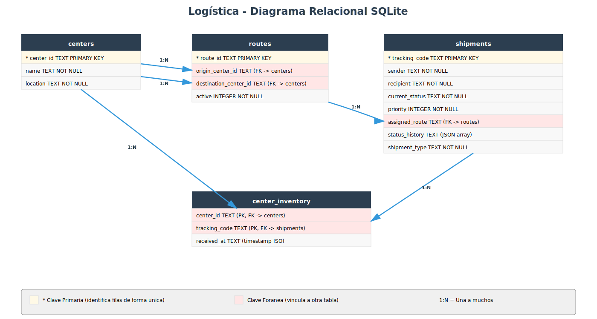

# Diseño de tablas SQLite para Sistema Logístico

Este documento te guía paso a paso para transformar tu proyecto de almacenamiento en memoria (diccionarios de Python) a una **base de datos SQLite persistente**. El objetivo es que entiendas qué tablas necesitas crear, por qué están diseñadas así y cómo escribir el SQL.

Como referencia, puedes consultar cómo se hizo esta misma transición en el proyecto de la expendedora.


## Fase 1: Identificar las entidades y sus atributos

El primer paso es hacer un inventario de las clases de tu dominio que almacenan datos. Cada una de estas clases se convertirá en una **tabla** de la base de datos.

Vamos a repasar tus clases y qué atributos de cada una necesitamos guardar:

**Shipment** (`domain/shipment.py`) — Clase base

| Atributo | Tipo en Python | Tipo en SQL | Notas |
|---|---|---|---|
| `tracking_code` | str | TEXT | Código único de seguimiento (ej: ABC123) |
| `sender` | str | TEXT | Nombre del remitente |
| `recipient` | str | TEXT | Nombre del destinatario |
| `current_status` | str | TEXT | REGISTERED, IN_TRANSIT, DELIVERED |
| `priority` | int | INTEGER | 1, 2 o 3 |
| `assigned_route` | str | TEXT | ID de ruta asignada (FK) |
| `status_history` | list[str] | TEXT | JSON array con historial de estados |
| (discriminador) | — | TEXT | Columna `shipment_type` para distinguir el tipo: STANDARD, EXPRESS, FRAGILE |

**ExpressShipment** — Hereda de Shipment
- Prioridad fija: 3

**FragileShipment** — Hereda de Shipment
- Prioridad mínima: 2 (validación en aplicación)

**Center** (`domain/center.py`)

| Atributo | Tipo en Python | Tipo en SQL | Notas |
|---|---|---|---|
| `center_id` | str | TEXT | Identificador único (ej: MAD01) |
| `name` | str | TEXT | Nombre del centro |
| `location` | str | TEXT | Ubicación física |
| `_shipments` | list[Shipment] | (1:N vía tabla auxiliar `center_inventory`) | Envíos presentes en el centro |

**Route** (`domain/route.py`)

| Atributo | Tipo en Python | Tipo en SQL | Notas |
|---|---|---|---|
| `route_id` | str | TEXT | ID único (ej: MAD01-BCN02-STD-001) |
| `origin_center` | Center | TEXT | FK a `centers(center_id)` (como `origin_center_id`) |
| `destination_center` | Center | TEXT | FK a `centers(center_id)` (como `destination_center_id`) |
| `_shipments` | list[Shipment] | (1:N vía columna `assigned_route` en `shipments`) | Envíos asignados a la ruta |
| `_active` | bool | INTEGER | 1=activa, 0=completada |


## Fase 2: Conceptos básicos de bases de datos

Antes de avanzar, necesitamos entender algunos conceptos:

### Tabla, fila y columna

Una **tabla** es como un diccionario de Python, pero guardado en disco:
- Cada **fila** es un objeto individual (un envío, un centro, una ruta)
- Cada **columna** es un atributo de ese objeto (el nombre, la ubicación, el estado, etc.)

**Ejemplo:**
```
Tabla: shipments
┌──────────┬────────-┬──────────┬────────────────┐
│ tracking │ sender  │ recipient│ current_status │
├──────────┼-────────┼──────────┼────────────────┤
│ ABC123   │ Tienda A│ Cliente X│ REGISTERED     │
│ DEF456   │ Tienda B│ Cliente Y│ IN_TRANSIT     │
└──────────┴────────-┴──────────┴────────────────┘
```

### Clave primaria (PRIMARY KEY)

Es la columna que **identifica de forma única cada fila**. No puede haber dos filas con el mismo valor en la clave primaria. En tu código:
- Para envíos → `tracking_code` es la clave primaria
- Para centros → `center_id` es la clave primaria
- Para rutas → `route_id` es la clave primaria

### Clave foránea (FOREIGN KEY)

Es una columna que "apunta" a la clave primaria de **otra tabla**. Sirve para crear vínculos entre tablas y permite que la base de datos garantice que esos vínculos siempre sean válidos.

**Ejemplo:** Un envío tiene un `assigned_route` que apunta a la clave primaria `route_id` de la tabla `routes`. Si intentas guardar un envío con una ruta que no existe, la base de datos lo rechazará automáticamente.

En SQLite, para que se apliquen restricciones al usar las claves foráneas lo hacemos con `PRAGMA foreign_keys = ON` al inicio de cada conexión.

### Relaciones entre tablas

Una **relación** describe cómo se vinculan las filas de una tabla A con las filas de otra tabla B. Los tipos más comunes son:

- **Uno a uno (1:1):** Una fila de la tabla A se vincula con exactamente una fila de la tabla B. Raro en bases de datos.
  - Ejemplo: un empleado tiene un único correo corporativo; un correo corporativo pertenece a un único empleado.

- **Uno a muchos (1:N):** Una fila de la tabla A se vincula con múltiples filas de la tabla B. Muy común.
  - Ejemplo en tu proyecto: un **centro** puede almacenar múltiples **envíos**. El centro MAD01 puede contener los envíos ABC123, DEF456 y GHI789.

- **Muchos a muchos (N:M):** Una fila de la tabla A se vincula con múltiples filas de la tabla B, y viceversa. Requiere una tabla intermedia.
  - Ejemplo general: un **alumno** puede estar matriculado en muchos **cursos**, y un **curso** puede tener muchos **alumnos**.
  - En tu proyecto NO hay relaciones N:M (todas son 1:N).

## Fase 3: Identificar las relaciones entre entidades

Cuando un objeto **"pertenece a"** o **"contiene"** otro, eso se traduce en la base de datos mediante **claves foráneas** (FK).

### Relaciones uno a muchos (1:N)

**Una ruta transporta muchos envíos**
- Cada envío está asignado a una sola ruta en un momento dado
- Usamos la columna `assigned_route` en la tabla `shipments` como clave foránea que apunta a `routes(route_id)`

**Un centro recibe muchos envíos**
- Cada envío pasa por varios centros durante su ciclo de vida (origen, destino, etc.)
- La tabla `center_inventory` registra qué envíos hay en cada centro y cuándo llegaron
- Esta tabla es auxiliar, para poder responder preguntas como: "¿Qué envíos están ahora en el centro de Madrid?"

### Herencia en el dominio

En tu código, `ExpressShipment` y `FragileShipment` heredan de `Shipment`. En SQL, usamos:

**Tabla única con discriminador** (la opción elegida)
- Una sola tabla `shipments` con columna `shipment_type` ('STANDARD', 'EXPRESS', 'FRAGILE')
- Más simple que dividir en varias tablas
- Evita uniones (joins) complicadas

## Fase 4: Diseño de las tablas

### Tabla `centers` — Los centros logísticos

Almacena cada centro de distribución de la red logística.

| Columna | Tipo | Notas |
|---|---|---|
| `center_id` | TEXT | Clave primaria: identificador único (ej: MAD01) |
| `name` | TEXT | Nombre del centro (ej: Centro Madrid) |
| `location` | TEXT | Ubicación geográfica (ej: Madrid, España) |

**¿Por qué estas columnas?** Cada atributo de la clase `Center` se convierte en una columna.


### Tabla `shipments` — Los envíos

Almacena todos los envíos del sistema, ya sean estándar, frágiles o express.

| Columna | Tipo | Notas |
|---|---|---|
| `tracking_code` | TEXT | Clave primaria: código único de seguimiento (ej: ABC123) |
| `sender` | TEXT | Nombre del remitente |
| `recipient` | TEXT | Nombre del destinatario |
| `current_status` | TEXT | Estado actual (REGISTERED, IN_TRANSIT, DELIVERED) |
| `priority` | INTEGER | Nivel de prioridad (1=estándar, 2=frágil, 3=express) |
| `assigned_route` | TEXT | Clave foránea → `routes(route_id)`. Puede ser NULL si no está asignado a ninguna ruta aún |
| `status_history` | TEXT | Historial de estados guardado como JSON (ej: `["REGISTERED", "IN_TRANSIT"]`) |
| `shipment_type` | TEXT | Discriminador: 'STANDARD', 'EXPRESS' o 'FRAGILE' |

**¿Por qué `shipment_type` es necesario?** Aunque `ExpressShipment` y `FragileShipment` heredan de `Shipment`, en SQL usamos una sola tabla. La columna `shipment_type` indica qué tipo de envío es, para poder reconstruir el objeto correcto cuando lo recuperes.

**¿Por qué `status_history` es TEXT y no una columna aparte?** Porque el historial es una lista de estados que crece con el tiempo. En SQL, almacenamos listas como texto en formato JSON, que es una forma estándar de representar datos estructurados.

### Tabla `routes` — Las rutas de transporte

Almacena las rutas de transporte entre centros.

| Columna | Tipo | Notas |
|---|---|---|
| `route_id` | TEXT | Clave primaria: identificador único (ej: MAD01-BCN02-STD-001) |
| `origin_center_id` | TEXT | Clave foránea → `centers(center_id)`. Centro de origen |
| `destination_center_id` | TEXT | Clave foránea → `centers(center_id)`. Centro de destino |
| `active` | INTEGER | 1 si está activa, 0 si está completada |

**¿Por qué dos claves foráneas a `centers`?** Porque una ruta tiene dos extremos: un origen y un destino, ambos deben ser centros que existan en la tabla `centers`.

### Tabla `center_inventory` — Inventario de centros

Registra qué envíos están en cada centro en cada momento. Es una tabla de unión (junction table) que responde preguntas como: "¿Qué envíos están ahora en el centro de Madrid?" o "¿Cuándo llegó el envío ABC123 al centro de Valencia?".

| Columna | Tipo | Notas |
|---|---|---|
| `center_id` | TEXT | Clave foránea → `centers(center_id)` (parte de PK compuesta) |
| `tracking_code` | TEXT | Clave foránea → `shipments(tracking_code)` (parte de PK compuesta) |
| `received_at` | TEXT | Timestamp ISO cuando el envío llegó al centro (ej: 2026-04-17T10:00:00) |

**¿Por qué clave primaria compuesta?** Porque lo que identifica de forma única una fila es la combinación de (center_id, tracking_code). La misma pareja no puede aparecer dos veces (un envío no puede "llegar" dos veces al mismo centro).

**¿Por qué `received_at` es TEXT?** SQLite almacena timestamps como strings en formato ISO 8601 (ej: "2026-04-17T10:00:00"). Es estándar y legible.

### Diagrama relacional resultante

Con el diseño de tablas descrito arriba, el esquema de la base de datos queda así:



El diagrama muestra las 4 tablas del sistema y sus relaciones:
- **centers → routes** (1:N, doble): un centro puede ser origen de muchas rutas y destino de muchas rutas (`origin_center_id` y `destination_center_id`)
- **routes → shipments** (1:N): una ruta puede transportar muchos envíos (`assigned_route`)
- **centers → center_inventory** (1:N): un centro registra muchos envíos en su inventario
- **shipments → center_inventory** (1:N): un envío puede aparecer en el inventario de varios centros a lo largo de su ciclo de vida


## Fase 5: SQL de creación de tablas

Aquí tienes el SQL completo para crear todas las tablas. **El orden importa:** las tablas que son referenciadas por otras (con claves foráneas) deben crearse primero.

```sql
PRAGMA foreign_keys = ON;

-- 1. Crear tabla de centros (no depende de ninguna otra tabla)
CREATE TABLE IF NOT EXISTS centers (
    center_id TEXT PRIMARY KEY,
    name TEXT NOT NULL,
    location TEXT NOT NULL
);

-- 2. Crear tabla de rutas (depende de centers para las FKs de origen y destino)
CREATE TABLE IF NOT EXISTS routes (
    route_id TEXT PRIMARY KEY,
    origin_center_id TEXT NOT NULL,
    destination_center_id TEXT NOT NULL,
    active INTEGER NOT NULL,
    FOREIGN KEY (origin_center_id) REFERENCES centers(center_id),
    FOREIGN KEY (destination_center_id) REFERENCES centers(center_id)
);

-- 3. Crear tabla de envíos (depende de routes para la FK de assigned_route)
CREATE TABLE IF NOT EXISTS shipments (
    tracking_code TEXT PRIMARY KEY,
    sender TEXT NOT NULL,
    recipient TEXT NOT NULL,
    current_status TEXT NOT NULL,
    priority INTEGER NOT NULL,
    assigned_route TEXT,
    status_history TEXT NOT NULL,
    shipment_type TEXT NOT NULL,
    FOREIGN KEY (assigned_route) REFERENCES routes(route_id)
);

-- 4. Crear tabla de inventario (depende de centers y shipments)
CREATE TABLE IF NOT EXISTS center_inventory (
    center_id TEXT NOT NULL,
    tracking_code TEXT NOT NULL,
    received_at TEXT NOT NULL,
    PRIMARY KEY (center_id, tracking_code),
    FOREIGN KEY (center_id) REFERENCES centers(center_id),
    FOREIGN KEY (tracking_code) REFERENCES shipments(tracking_code)
);
```

**Explicación del orden:**
1. **centers** se crea primero porque no tiene claves foráneas
2. **routes** se crea segunda porque necesita que centers ya exista
3. **shipments** se crea tercera porque necesita que routes ya exista
4. **center_inventory** se crea última porque necesita que centers y shipments existan


## Fase 6: Script de ejemplo para crear la base de datos

Este script Python crea la base de datos con todas las tablas e inserta datos iniciales de prueba.

```python
"""Script para crear la base de datos de Logística con datos iniciales."""

import sqlite3
import json
from pathlib import Path
from datetime import datetime

# Eliminar la base de datos si ya existe (para recrearla limpia)
ruta_bd = Path("logistica.db")
if ruta_bd.exists():
    ruta_bd.unlink()

conn = sqlite3.connect("logistica.db")
cursor = conn.cursor()
cursor.execute("PRAGMA foreign_keys = ON")

# Crear tablas (en el orden correcto: sin dependencias primero, luego con dependencias)
cursor.executescript("""
PRAGMA foreign_keys = ON;

CREATE TABLE IF NOT EXISTS centers (
    center_id TEXT PRIMARY KEY,
    name TEXT NOT NULL,
    location TEXT NOT NULL
);

CREATE TABLE IF NOT EXISTS routes (
    route_id TEXT PRIMARY KEY,
    origin_center_id TEXT NOT NULL,
    destination_center_id TEXT NOT NULL,
    active INTEGER NOT NULL,
    FOREIGN KEY (origin_center_id) REFERENCES centers(center_id),
    FOREIGN KEY (destination_center_id) REFERENCES centers(center_id)
);

CREATE TABLE IF NOT EXISTS shipments (
    tracking_code TEXT PRIMARY KEY,
    sender TEXT NOT NULL,
    recipient TEXT NOT NULL,
    current_status TEXT NOT NULL,
    priority INTEGER NOT NULL,
    assigned_route TEXT,
    status_history TEXT NOT NULL,
    shipment_type TEXT NOT NULL,
    FOREIGN KEY (assigned_route) REFERENCES routes(route_id)
);

CREATE TABLE IF NOT EXISTS center_inventory (
    center_id TEXT NOT NULL,
    tracking_code TEXT NOT NULL,
    received_at TEXT NOT NULL,
    PRIMARY KEY (center_id, tracking_code),
    FOREIGN KEY (center_id) REFERENCES centers(center_id),
    FOREIGN KEY (tracking_code) REFERENCES shipments(tracking_code)
);
""")

# Insertar datos iniciales

# 1. Crear centros
cursor.execute("""
    INSERT INTO centers (center_id, name, location)
    VALUES ('MAD01', 'Centro Madrid', 'Madrid, España')
""")

cursor.execute("""
    INSERT INTO centers (center_id, name, location)
    VALUES ('BCN02', 'Centro Barcelona', 'Barcelona, España')
""")

cursor.execute("""
    INSERT INTO centers (center_id, name, location)
    VALUES ('VAL03', 'Centro Valencia', 'Valencia, España')
""")

# 2. Crear rutas
cursor.execute("""
    INSERT INTO routes (route_id, origin_center_id, destination_center_id, active)
    VALUES ('MAD01-BCN02-STD-001', 'MAD01', 'BCN02', 1)
""")

cursor.execute("""
    INSERT INTO routes (route_id, origin_center_id, destination_center_id, active)
    VALUES ('MAD01-VAL03-FRG-001', 'MAD01', 'VAL03', 1)
""")

# 3. Crear envíos (asignados a rutas)
cursor.execute("""
    INSERT INTO shipments (tracking_code, sender, recipient, current_status, priority, assigned_route, status_history, shipment_type)
    VALUES ('ABC123', 'Tienda A', 'Cliente X', 'REGISTERED', 1, 'MAD01-BCN02-STD-001', 
            '["REGISTERED"]', 'STANDARD')
""")

cursor.execute("""
    INSERT INTO shipments (tracking_code, sender, recipient, current_status, priority, assigned_route, status_history, shipment_type)
    VALUES ('DEF456', 'Tienda B', 'Cliente Y', 'REGISTERED', 3, 'MAD01-BCN02-STD-001',
            '["REGISTERED"]', 'EXPRESS')
""")

cursor.execute("""
    INSERT INTO shipments (tracking_code, sender, recipient, current_status, priority, assigned_route, status_history, shipment_type)
    VALUES ('GHI789', 'Tienda C', 'Cliente Z', 'REGISTERED', 2, 'MAD01-VAL03-FRG-001',
            '["REGISTERED"]', 'FRAGILE')
""")

# 4. Registrar envíos en centros (inventario)
cursor.execute("""
    INSERT INTO center_inventory (center_id, tracking_code, received_at)
    VALUES ('MAD01', 'ABC123', '2026-04-17T10:00:00')
""")

cursor.execute("""
    INSERT INTO center_inventory (center_id, tracking_code, received_at)
    VALUES ('MAD01', 'DEF456', '2026-04-17T10:05:00')
""")

cursor.execute("""
    INSERT INTO center_inventory (center_id, tracking_code, received_at)
    VALUES ('MAD01', 'GHI789', '2026-04-17T10:10:00')
""")

conn.commit()
conn.close()

print("Base de datos creada en: logistica.db")
```

**Características importantes:**
- Elimina la BD existente para recrearla limpia (idempotente)
- Crea las tablas en el orden correcto
- Inserta datos de ejemplo que puedes usar para probar
- Activa integridad referencial con `PRAGMA foreign_keys = ON`


## Fase 7: Ejemplo de implementación del repositorio SQLite

Aquí tienes un ejemplo de cómo implementaría uno de tus repositorios usando SQLite en lugar de diccionarios en memoria.

**Importante:** Este ejemplo asume que ya has creado las **excepciones de dominio** en `infrastructure/errores.py` (ver "Excepciones de dominio para persistencia" en la checklist de la Fase 04). Si aún no las has creado, debes hacerlo primero. Las excepciones necesarias son:

```python
class ErrorRepositorio(Exception):
    """Clase base para todas las excepciones del repositorio."""
    pass

class ShipmentYaExisteError(ErrorRepositorio):
    """Se lanza cuando se intenta guardar un envío con código duplicado."""
    pass

class ShipmentNoEncontradoError(ErrorRepositorio):
    """Se lanza cuando se intenta recuperar un envío inexistente."""
    pass

class ErrorPersistencia(ErrorRepositorio):
    """Se lanza para errores inesperados de la base de datos."""
    pass
```

**Nota sobre el modelo actual de tu proyecto:** En tu implementación, los constructores de `Shipment` y sus subclases reciben solo los datos básicos (`tracking_code`, `sender`, `recipient` y opcionalmente `priority`). El resto de atributos (`current_status`, `status_history`, `assigned_route`) se inicializan con valores por defecto y solo se modifican mediante métodos del dominio (ej: `assign_route()`, `advance_status()`, etc.). Además, `shipment_type` no es un parámetro del constructor sino una `@property` de solo lectura (la clase base devuelve `"STANDARD"`, y las subclases la sobrescriben para devolver `"EXPRESS"` o `"FRAGILE"`).

Esto implica que al **reconstruir** un envío desde la BD, primero creas el objeto con el constructor que corresponda y después restauras los atributos internos (`_current_status`, `_status_history`, `_assigned_route`) directamente.

**Ejemplo para `ShipmentRepositorySQLite` — Método `add()`:**

```python
import sqlite3
import json
from infrastructure.errores import ShipmentYaExisteError, ErrorPersistencia


class ShipmentRepositorySQLite:
    def __init__(self, ruta_bd="logistica.db"):
        self._ruta_bd = ruta_bd

    def add(self, shipment):
        """Guarda un nuevo envío en la base de datos."""
        conn = sqlite3.connect(self._ruta_bd)
        try:
            with conn:
                cursor = conn.cursor()
                cursor.execute("PRAGMA foreign_keys = ON")
                cursor.execute(
                    """INSERT INTO shipments
                       (tracking_code, sender, recipient, current_status, priority,
                        assigned_route, status_history, shipment_type)
                       VALUES (?, ?, ?, ?, ?, ?, ?, ?)""",
                    (
                        shipment.tracking_code,
                        shipment.sender,
                        shipment.recipient,
                        shipment.current_status,      # @property pública
                        shipment.priority,            # @property pública
                        shipment.assigned_route,      # @property pública
                        json.dumps(shipment.get_status_history()),  # método público
                        shipment.shipment_type,       # @property pública: STANDARD/EXPRESS/FRAGILE
                    ),
                )
        except sqlite3.IntegrityError as e:
            # IntegrityError → violación de PRIMARY KEY (tracking_code duplicado)
            raise ShipmentYaExisteError(
                f"Ya existe un envío con código '{shipment.tracking_code}'"
            ) from e
        except sqlite3.OperationalError as e:
            # OperationalError → problema técnico (conexión, sintaxis, permisos)
            raise ErrorPersistencia(f"Error al guardar el envío: {e}") from e
        finally:
            conn.close()
```

**Explicación:**
1. Abre conexión a la BD: `conn = sqlite3.connect(self._ruta_bd)`.
2. Activa integridad referencial: `cursor.execute("PRAGMA foreign_keys = ON")`.
3. Usa `?` en la consulta SQL para parámetros (previene inyección SQL).
4. Lee los valores desde las `@property` públicas del envío (o desde su método `get_status_history()` para el historial).
5. Si hay un `IntegrityError` (clave primaria duplicada), transforma a `ShipmentYaExisteError`.
6. Si hay otro error técnico, transforma a `ErrorPersistencia`.
7. Cierra la conexión siempre (en el `finally`).

**Ejemplo para `ShipmentRepositorySQLite` — Método `get_by_tracking_code()`:**

```python
import json
from infrastructure.errores import ShipmentNoEncontradoError, ErrorPersistencia
from logistica.domain.shipment import Shipment
from logistica.domain.express_shipment import ExpressShipment
from logistica.domain.fragile_shipment import FragileShipment


    def get_by_tracking_code(self, tracking_code):
        """Recupera un envío por su código de seguimiento."""
        conn = sqlite3.connect(self._ruta_bd)
        try:
            cursor = conn.cursor()
            cursor.execute("PRAGMA foreign_keys = ON")
            cursor.execute(
                """SELECT tracking_code, sender, recipient, current_status, priority,
                          assigned_route, status_history, shipment_type
                   FROM shipments WHERE tracking_code = ?""",
                (tracking_code,),
            )
            row = cursor.fetchone()
            if row is None:
                raise ShipmentNoEncontradoError(
                    f"No existe envío con código '{tracking_code}'"
                )
            return self._fila_a_shipment(row)
        except sqlite3.OperationalError as e:
            raise ErrorPersistencia(f"Error al obtener el envío: {e}") from e
        finally:
            conn.close()

    def _fila_a_shipment(self, row):
        """Convierte una fila de la BD en un objeto Shipment del tipo correcto."""
        (
            tracking_code,
            sender,
            recipient,
            current_status,
            priority,
            assigned_route,
            status_history_json,
            shipment_type,
        ) = row

        # 1) Construir el objeto del tipo correcto usando los constructores reales
        if shipment_type == "EXPRESS":
            shipment = ExpressShipment(tracking_code, sender, recipient)
        elif shipment_type == "FRAGILE":
            shipment = FragileShipment(tracking_code, sender, recipient, priority=priority)
        else:
            shipment = Shipment(tracking_code, sender, recipient, priority=priority)

        # 2) Restaurar el estado interno desde los datos persistidos
        #    (estos atributos no se pasan en el constructor, se modifican internamente)
        shipment._current_status = current_status
        shipment._status_history = json.loads(status_history_json)
        shipment._assigned_route = assigned_route

        return shipment
```

**Puntos clave de ambos métodos:**
- Siempre activa `PRAGMA foreign_keys = ON` para garantizar integridad referencial.
- Usa parámetros `?` en lugar de concatenar strings (previene inyección SQL).
- Transforma excepciones técnicas de SQLite en excepciones de dominio.
- Usa `json.dumps()` al guardar listas (como `status_history`) y `json.loads()` al recuperar.
- El constructor de tus clases de dominio solo acepta datos de creación; el estado dinámico (estado actual, historial, ruta asignada) se restaura después asignando directamente a los atributos privados.
- Usa `shipment_type` como discriminador para elegir la clase correcta (`Shipment`, `ExpressShipment` o `FragileShipment`).


## Resumen: de memoria a SQLite

### Mapeado de conceptos

| Código Python (fase actual, en memoria) | Base de datos SQLite (fase 04) | Propósito |
|---|---|---|
| `_shipments = {}` | Tabla `shipments` (con columna `shipment_type`) | Guardar todos los envíos persistentemente |
| `_centers = {}` | Tabla `centers` | Guardar todos los centros persistentemente |
| `_routes = {}` | Tabla `routes` | Guardar todas las rutas persistentemente |
| `center._shipments` (lista interna) | Tabla `center_inventory` | Saber qué envíos están en cada centro en cada momento |

### Beneficios de migrar a SQLite

- **Persistencia:** Los datos no desaparecen al cerrar el programa
- **Integridad referencial:** Las claves foráneas garantizan que no habrá datos rotos (ej: un envío asignado a una ruta que no existe)
- **Escalabilidad:** Manejo eficiente de grandes volúmenes de datos
- **Trazabilidad:** El historial de estados está en JSON, fácil de consultar
- **Estándar:** SQL es un estándar conocido y usado en la industria
- **Simple:** SQLite no necesita un servidor externo, es un fichero `logistica.db`

### Arquitectura en capas (sin cambios en lógica)

```
┌─────────────────────────────────────┐
│  Presentation (menú)                │
│  - No toca datos                    │
└──────────────┬──────────────────────┘
               │ usa
┌──────────────▼──────────────────────┐
│  Application (servicios)            │
│  - ShipmentService                  │
│  - CenterService, RouteService      │
│  - Usa repositorios                 │
└──────────────┬──────────────────────┘
               │ usa
┌──────────────▼──────────────────────┐
│  Domain (entidades + contratos)     │
│  - Shipment, Center, Route          │
│  - ShipmentRepository (contrato)    │
└──────────────┬──────────────────────┘
               │ implementado por
┌──────────────▼──────────────────────┐
│  Infrastructure (implementación)    │
│  - ShipmentRepositorySQLite         │
│  - Lee/escribe en tablas            │
└─────────────────────────────────────┘
```

**Lo importante:** Domain y Application no cambian. Solo Infrastructure.

## Estado de la Checklist Fase 04

Marcamos con [x] los apartados que **este documento cubre o sirve de referencia** y con [ ] los que son **responsabilidad tuya** dentro de tu proyecto. Para los apartados pendientes puedes consultar cómo se hicieron en el proyecto modelo de la expendedora (`modelo/cepy_pd4/proyecto/04-sqlite/expendedora/`).

### Diseño e implementación del esquema de base de datos

- [ ] Copiar en `04-sqlite` el estado base de `03-testing` (o crear rama específica para la fase 04) — *Responsabilidad tuya*
- [x] Diseñar las tablas SQL mapeando cada entidad de dominio a tablas con sus columnas, tipos y restricciones (`PRIMARY KEY`, `NOT NULL`, `FOREIGN KEY`) — **Fases 1-4 de este documento**
- [x] Usar nombres de columnas en snake_case — **Fase 4 de este documento**

### Script de inicialización de base de datos

- [x] Crear script que cree el esquema de la BD e inserte datos iniciales de prueba — **Fase 6 de este documento**
  - [x] Debe poder ejecutarse varias veces sin error — **Fase 6**
  - [x] Crea todas las tablas respetando dependencias de claves foráneas — **Fases 5-6**
  - [x] Inserta datos iniciales para probar la aplicación — **Fase 6**

### Excepciones de dominio para persistencia

- [ ] (*opcional*) Crear fichero de excepciones (`infrastructure/errores.py`) con las excepciones que el repositorio SQLite lanza al usuario — **Fase 7 de este documento (código de ejemplo)**
  - [ ] Clase base para todas las excepciones de persistencia — **Fase 7**
  - [ ] Excepciones por cada tipo de error que puede ocurrir (duplicado, no encontrado, etc.) — **Fase 7**

### Implementación del repositorio SQLite

- [ ] Crear clase(s) de repositorio que implementen persistencia en SQLite (realizando las mismas operaciones que el repositorio en memoria: guardar, obtener, actualizar, eliminar, etc.) — **Fase 7 de este documento (código de ejemplo)**
- [ ] Usar consultas SQL parametrizadas (parámetros `?`) para prevenir inyección SQL — **Fase 7**
- [ ] Capturar excepciones SQLite (`sqlite3.IntegrityError`, `sqlite3.OperationalError`, etc.) y transformarlas en excepciones de dominio — **Fase 7**
- [ ] Activar `PRAGMA foreign_keys = ON` al conectar para garantizar integridad referencial — **Fase 7**
- [ ] **El flujo principal de la aplicación (menú) debe usar SOLO el repositorio SQLite para persistencia** (no usar en memoria) — *Responsabilidad tuya*

### Repositorio en memoria (referencia, no en uso)

- [ ] (**opcional**) Mantener el código del repositorio en memoria como referencia de implementación y contrato — *Responsabilidad tuya*
- [ ] (**opcional**) Modificar `infrastructure/repositorio_memoria.py` para lanzar las **mismas excepciones de dominio** que el repositorio SQLite (útil para tests sin persistencia) — *Responsabilidad tuya*

### Integración con SQLite en la capa de presentación

- [ ] Modificar la capa de presentación para cargar datos iniciales desde la BD en lugar de desde memoria (al iniciar la aplicación) — *Responsabilidad tuya*
- [ ] Capturar excepciones de dominio, no excepciones de `sqlite3` — *Responsabilidad tuya*
- [ ] (*opcional*) Mostrar mensajes amigables al usuario cuando ocurran errores de persistencia — *Responsabilidad tuya*
- [ ] No hacer imports de `sqlite3` directamente en la presentación — *Responsabilidad tuya*

### Actualización de los tests

- [ ] *(opcional)* Actualizar tests existentes para esperar excepciones de dominio en lugar de excepciones genéricas de Python — *Responsabilidad tuya*
- [ ] Verificar que `python -m unittest` pasa con todos los tests en verde — *Responsabilidad tuya*
- [ ] *(opcional)* Crear tests específicos para el repositorio SQLite — *Responsabilidad tuya*

### Documentación

- [ ] Actualizar `CHANGELOG.md` (versión `0.4.0`) con los cambios principales — *Responsabilidad tuya*
- [ ] Actualizar `README.md` con instrucciones de cómo ejecutar el script de inicialización — *Responsabilidad tuya*
- [ ] Documentar el diseño de la BD en `docs/DISEÑO_BD.md` (opcional) — *Este documento es base para completarlo*
- [ ] (*opcional*) Documentar el contrato de excepciones en `docs/CONTRATO_EXCEPCIONES.md` — *Responsabilidad tuya*

### Verificación final

- [ ] La aplicación funciona igual desde el punto de vista del usuario (mismo menú, mismas operaciones) — *Responsabilidad tuya*
- [ ] Los datos persisten entre ejecuciones (cierra y reabre la app, verifica que los datos están) — *Responsabilidad tuya*
- [ ] Los tests pasan todos sin cambios de lógica de dominio — *Responsabilidad tuya*


## Próximos pasos

1. Lee este documento con atención, especialmente las Fases 2-4.
2. Crea la subcarpeta `04-sqlite/` copiando el estado base de `03-testing/`.
3. Crea la base de datos ejecutando el script de la Fase 6 (`crear_bd.py`).
4. Crea el fichero de excepciones de dominio `infrastructure/errores.py` siguiendo el ejemplo de la Fase 7.
5. Implementa los repositorios SQLite en `infrastructure/` (usa el código de Fase 7 como referencia y el proyecto de la expendedora como ejemplo completo).
6. Modifica la capa de presentación para que use solo el repositorio SQLite y capture las excepciones de dominio.
7. Actualiza los tests para esperar excepciones de dominio.
8. Completa la documentación: `docs/DISEÑO_BD.md`, `docs/CONTRATO_EXCEPCIONES.md` (opcional), `CHANGELOG.md` (versión `0.4.0`) y `README.md` con instrucciones de `crear_bd.py`.


